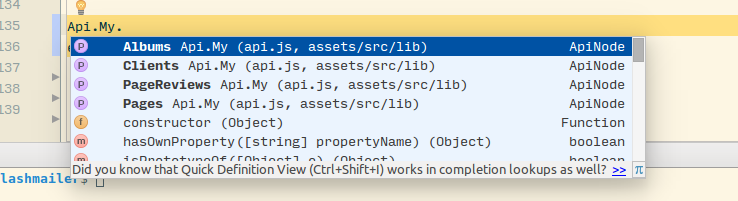
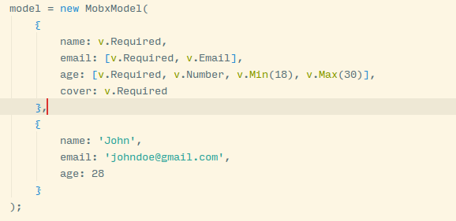

# mobx-rest-assured
REST API lib for Mobx that make sense. Let's start with the kōans

## kōans
1. I want my API runtime to be modular, but each module must be self-contained
2. I want API runtime to incorporate all the goods the modern IDE can provide, like autocompletion or type linting, without extra plugins and memorizing magic string sigils. 

3. I want my API runtime to be state-less for API, but have state for a resource it returns.
4. The only exception is authentification. It must be API-wide.

5. For PUT/PATCH/UPDATE, I want API runtime to provide basic model validation. Both client and server side. Again, no magic string sigils.

6. For GET I want API runtime to allow me refresh resource without a hassle 
7. For GET I want API runtime to use pagination without suffering. Next page, previous page, total pages, current page, has next page, has previous page.
8. I want API runtime to be extensible and working with all shiny modern language features (async/await, fallback to promises) 
